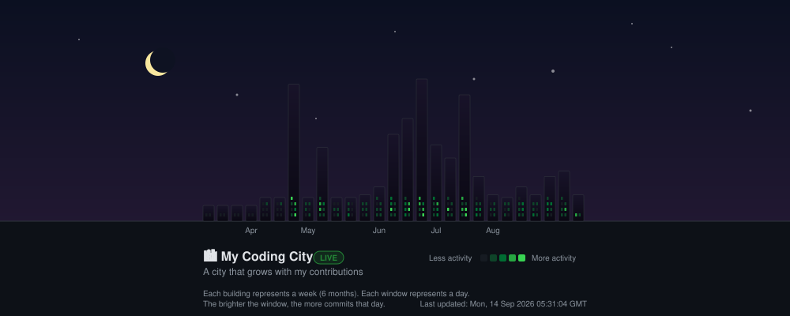

<!-- Text Animation -->

  

---

# 🏙️ My Coding City

  

A city that grows with every contribution.

---

<!-- GitHub Metrics -->

  
  

  
  

---
<!-- Contribution Graph -->

  

---

<!-- Profile Views Counter -->

  

